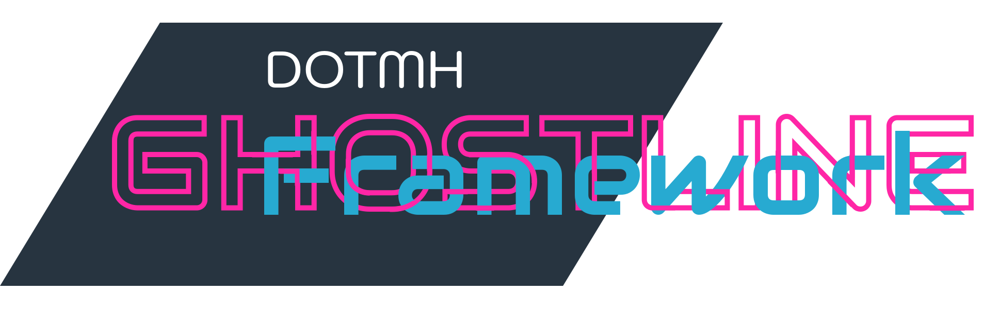

# {{ Insert Plugin Name }}
[](https://github.com/dotmh/ghostline)
[](https://www.dotmh.io)
[](https://lerna.js.org/)

{{ introduction }}

This plugin is intended for use with the [Ghostline Framework](https://github.com/dotmh/ghostline). It may work on straight [Metalsmith](https://metalsmith.io/) but it makes assumptions that you are running it on the Ghostline Framework. 

## Installation 

Installation is simple, using NPM (or your favourite node package manager)

```bash
npm i @ghostline/{{ package name}}
```

You can also install one of the bundles {{ Bundle list }} , see the [main readme](https://github.com/dotmh/ghostline/blob/master/README.md) for more information.

## Usage

```js
const {{ plugin name }} = require('@ghostline/{{package name}}');
```

{{ insert usage instructions}}

## Documentation 

See [main readme](https://github.com/dotmh/ghostline/blob/master/README.md#Documenation)

## Licence

This package is [Treeware](https://treeware.earth). If you use it in production, then we ask that you [**buy the world a tree**](https://plant.treeware.earth/dotmh/lambda-controller) to thank us for our work. By contributing to the Treeware forest you’ll be creating employment for local families and restoring wildlife habitats.

## Credits

Logo design by [@dotmh](https://www.dotmh.io)
